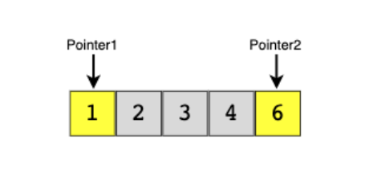

**Two Pointers**

**Usage:**  This technique uses two pointers to iterate input data. Generally, both pointers move in the opposite direction at a constant interval.

**DS Involved:** Array, String, LinkedList

Sample Problems:

1. **Squaring a Sorted Array**:
   Given a sorted array of integers, return a new array where each element is the square of the original array's elements in non-decreasing order. This problem can be solved using the Two Pointers technique where one pointer starts from the beginning (for negative numbers) and another pointer starts from the end (for positive numbers), allowing us to square and merge the elements in sorted order.

   [Solution link - LeetCode](https://leetcode.com/problems/squares-of-a-sorted-array/)

2. **Dutch National Flag Problem**:
   Given an array containing only 0s, 1s, and 2s, sort the array in-place. This problem can be solved using the Two Pointers technique where three pointers are used to partition the array into three regions representing the Dutch flag's colors (red, white, and blue).

   [Solution link - GeeksforGeeks](https://www.geeksforgeeks.org/sort-an-array-of-0s-1s-and-2s/)

3. **Minimum Window Sort**:
   Given an array of integers, return the length of the shortest subarray that, when sorted, results in the entire array being sorted in non-decreasing order. This problem can be solved using the Two Pointers technique where two pointers are used to find the boundaries of the unsorted subarray.

   [Solution link - LeetCode](https://leetcode.com/problems/shortest-unsorted-continuous-subarray/)

4. **Two Sum II - Input array is sorted**:
   Given an array of integers that is already sorted in non-decreasing order, find two numbers such that they add up to a specific target number. This problem can be solved using the Two Pointers technique where one pointer starts from the beginning and the other starts from the end, moving towards each other.

   [Solution link - LeetCode](https://leetcode.com/problems/two-sum-ii-input-array-is-sorted/)

5. **Container With Most Water**:
   Given n non-negative integers a1, a2, ..., an, where each represents a point at coordinate (i, ai), n vertical lines are drawn such that the two endpoints of the line i is at (i, ai) and (i, 0). Find two lines, which, together with the x-axis forms a container, such that the container contains the most water. This problem can be solved using the Two Pointers technique to optimize the area calculation by moving pointers towards each other.

   [Solution link - LeetCode](https://leetcode.com/problems/container-with-most-water/)

6. **Trapping Rain Water**:
   Given n non-negative integers representing an elevation map where the width of each bar is 1, compute how much water it can trap after raining. This problem can be solved using the Two Pointers technique where two pointers are used to determine the maximum height of the left and right sides of the current position.

   [Solution link - LeetCode](https://leetcode.com/problems/trapping-rain-water/)

7. **3Sum**:
   Given an array nums of n integers, are there elements a, b, c in nums such that a + b + c = 0? Find all unique triplets in the array which gives the sum of zero. This problem can be solved using the Two Pointers technique by first sorting the array and then using a combination of pointers to find the triplets.

   [Solution link - LeetCode](https://leetcode.com/problems/3sum/)

8. **Remove Duplicates from Sorted Array**:
   Given a sorted array nums, remove the duplicates in-place such that each element appears only once and returns the new length. This problem can be solved using the Two Pointers technique where one pointer is used to iterate through the array and another pointer is used to track the position to overwrite duplicates.

   [Solution link - LeetCode](https://leetcode.com/problems/remove-duplicates-from-sorted-array/)

9. **Longest Substring Without Repeating Characters**:
   Given a string s, find the length of the longest substring without repeating characters. This problem can be solved using the Two Pointers technique where one pointer is used to iterate through the string and another pointer is used to track the start of the current substring.

   [Solution link - LeetCode](https://leetcode.com/problems/longest-substring-without-repeating-characters/)

10. **Move Zeroes**:
    Given an array nums, write a function to move all 0's to the end of it while maintaining the relative order of the non-zero elements. This problem can be solved using the Two Pointers technique where one pointer is used to iterate through the array and another pointer is used to track the position to place non-zero elements.

    [Solution link - LeetCode](https://leetcode.com/problems/move-zeroes/)

